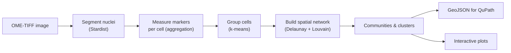

# CellSurvey

CellSurvey is a pipeline for **image-based spatial biology** analysis, built on
[Sopa](https://gustaveroussy.github.io/sopa/). It turns multichannel microscopy
images (OME-TIFF) into a spatial map of segmented cells, groups them into
clusters and communities, and exports the result for interactive viewing.

<!-- prettier-ignore -->


## Who is this for?

CellSurvey is aimed at **researchers and bioinformaticians** working with
multiplexed tissue imaging — no Python expertise required to run it. A single
command takes you from raw image to labelled cells and communities.

The pipeline automates these steps:

1. **Segment** cell nuclei with [Stardist](https://github.com/stardist/stardist).
2. **Measure** the intensity of every marker channel within each cell.
3. **Cluster** cells into expression-based groups (k-means).
4. **Build a spatial network** of neighbouring cells and detect communities
   (Delaunay triangulation + Louvain).
5. **Export** everything — cell boundaries, clusters, communities, and (optional)
   RNA spots — as GeoJSON for [QuPath](https://qupath.github.io/), plus a set of
   summary plots.

## Quick start

```bash
# Install the environment (Linux, GPU recommended)
pixi install

# Run the pipeline
pixi run python run.py \
  -i path/to/image.ome.tiff \
  -o path/to/output \
  -p path/to/plots
```

The output is a SpatialData Zarr store (`output_seg.zarr`) plus a
`qupath_export.geojson` file and a directory of plots.

!!! tip "Continue reading"
    Start with the [Installation](installation.md) guide, then follow
    [Getting started](getting-started.md) for your first full run.

## How the results are organised

After a run you get:

| Output | What it is |
|---|---|
| `*_seg.zarr` | SpatialData store: cells, boundaries, and per-cell measurements |
| `qupath_export.geojson` | Cell boundaries + clusters + communities for QuPath |
| `summary.json` | Counts of cells, clusters, communities, and network edges |
| `*.png` plots | Density maps, UMAP embeddings, heatmaps |

See [Outputs](outputs.md) for a full description of every file, and
[Visualising results](visualization.md) to open them in a viewer.

## Where to go next

- [Installation](installation.md) — set up the environment
- [Getting started](getting-started.md) — your first run
- [Pipeline](pipeline.md) — how each stage works
- [Parameters](parameters.md) — every option, explained
- [FAQ](faq.md) — common questions and troubleshooting
