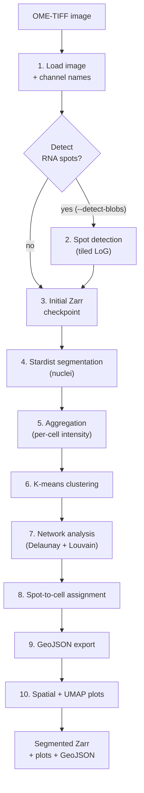

# Pipeline

CellSurvey turns a multichannel image into labelled cells and communities in a
sequence of ten stages. This page walks through each stage: what it does, what
it takes in, and what it produces.

!!! tip "Just want to run it?"
    If you only need the command, see [Getting started](getting-started.md).
    This page is for understanding *how* the result is produced.

## Overview

Each stage is described below, with the module/function that performs it.

---

## 1. Image loading

Reads the input image and discovers its channel (marker) names.

- **What it does**: loads the multichannel image with `sopa.io.ome_tif()`, and
  reads channel names from the OME-XML metadata via `BioImage` (from `bioio`).
- **Input**: an OME-TIFF (or plain multi-channel TIFF).
- **Output**: a SpatialData dataset, plus a list of channel names.
- **Where**: `cellsurvey/cli.py`.

There are three code paths depending on the flags:

| Situation | Behaviour |
|---|---|
| Neither `--resume-from` nor `--detect-blobs` | Load full image, write Zarr immediately (stage 3). |
| `--detect-blobs` | Load only the channels needed for spot detection, then write Zarr with spots. |
| `--resume-from` | Skip loading entirely — read channel names from the existing image, but open the Zarr directly. |

!!! note "Input format"
    Only **multi-channel TIFF** is supported (`.ome.tiff`, `.tiff`, `.tif`).
    ND2 / CZI / LIF / DV and single-channel 2D images are not currently
    accepted. See [FAQ](faq.md).

## 2. Spot / blob detection (optional)

Detects RNA spots, only when `--detect-blobs` is passed.

- **What it does**: for each configured channel, runs tiled
  Laplacian-of-Gaussian blob detection (`skimage.feature.blob_log`), parallelised
  with `dask`. Overlapping tiles and overlap-region filtering avoid double
  counting at tile seams.
- **Input**: the channel subset specified by `--channels`.
- **Output**: a `spots` points layer added to the dataset.
- **Where**: `cellsurvey/blob_detection.py` (`detect_blobs_tiled`).

The channels and their thresholds are set with `--channels` and `--thresholds`
(must have equal length). See [Parameters](parameters.md).

## 3. Initial Zarr write

Writes the dataset (with or without spots) to disk as a SpatialData Zarr store.

- **What it does**: persists a clean checkpoint before the expensive
  segmentation step.
- **Output**: `<output>.zarr`.
- **Where**: `cellsurvey/cli.py`.

This checkpoint is intentional: the pipeline writes it, then immediately reads
it back before segmentation, so the spots-including dataset is materialised as a
clean state.

## 4. Stardist segmentation

Segments cell nuclei.

- **What it does**: detects a GPU (with `--use-gpu` forcing it if auto-detection
  fails), makes image patches, then runs `sopa.segmentation.stardist()` with the
  `2D_versatile_fluo` model on the first channel.
- **Input**: the initial Zarr (`<output>.zarr`).
- **Output**: `stardist_boundaries` shapes (cell polygons).
- **Where**: `cellsurvey/cli.py`.

!!! warning "CPU fallback"
    If no GPU is found and `--use-gpu` is not set, Stardist runs on CPU — this
    works but is very slow. See [FAQ](faq.md).

### Resume / crash recovery

When `--resume-from` is set, the pipeline first checks whether a segmented Zarr
(`*_seg.zarr`) already exists:

| Existing `*_seg.zarr` state | What happens |
|---|---|
| Has a table | Skips Stardist **and** aggregation, jumps straight to clustering. |
| Has boundaries but no table | Skips Stardist, re-runs aggregation only. |
| Missing or unreadable | Deletes it and re-runs the full segmentation + aggregation. |

## 5. Channel aggregation

Measures the mean intensity of every channel inside every cell.

- **What it does**: runs `sopa.aggregate()` to compute per-cell mean intensities.
  If a `spots` layer is present, it also assigns spots to cells
  (`aggregate_genes=True`).
- **Input**: the segmented dataset.
- **Output**: an AnnData table (`table`) of cells × markers.
- **Where**: `cellsurvey/cli.py`.

## 6. K-means clustering

Groups cells by their expression profile.

- **What it does**: extracts the intensity matrix from the AnnData table,
  standardises it (`StandardScaler`), and runs k-means with `--n-clusters`.
- **Output**: a `kmeans_cluster` label per cell.
- **Where**: `cellsurvey/utils.py` (`cluster_data`).

## 7. Network analysis

Builds a spatial network of neighbouring cells and detects communities.

- **What it does**: extracts cell centroids, builds a `scipy.spatial.Delaunay`
  triangulation, filters edges longer than `--max-edge-distance`, weights the
  remaining edges by expression similarity (`1 + Pearson correlation`), and runs
  Louvain community detection (`networkx`) at `--community-resolution`.
- **Output**: `kmeans_cluster` and `community` labels, plus `summary.json`
  (cell / cluster / community / edge counts).
- **Where**: `cellsurvey/network_analysis.py` (`run_network_analysis`).

!!! info "Deterministic"
    Both k-means and Louvain use a fixed random seed (42), so the same input and
    parameters give the same result.

## 8. Spot-to-cell assignment

Assigns each detected spot to the cell that contains it.

- **What it does**: a spatial join of spots to cell boundaries
  (`gpd.sjoin(predicate='within')`).
- **Output**: each spot linked to a `cell_id` (or left unassigned).
- **Where**: `cellsurvey/utils.py` (`assign_spots_to_cells`).

If no spots were detected, this stage is skipped entirely.

## 9. QuPath GeoJSON export

Exports everything for viewing in QuPath.

- **What it does**: writes cell boundaries and (optional) spots as GeoJSON
  features, coloured by community, with cluster and per-marker measurements.
- **Output**: the file at `--geojson-path` (default `./qupath_export.geojson`).
- **Where**: `cellsurvey/export.py` (`export_to_qupath`).

## 10. Spatial neighbourhood and visualisation

Produces the summary plots and persists the final result.

- **What it does**: computes a spatial-neighbours radius graph and mean-hop
  distance between clusters, UMAP embeddings, and Leiden clustering, then renders
  the plots below. Finally it writes the segmented Zarr
  (`<output>_seg.zarr`).
- **Where**: `cellsurvey/cli.py`.

### Generated plots

| File | What it shows |
|---|---|
| `cell_type_to_cell_type.png` | Mean hop distance between clusters |
| `umap_kmeans_cluster.png` | UMAP coloured by k-means cluster |
| `umap_leiden.png` | UMAP coloured by Leiden cluster |
| `cell_density.png` | Per-cluster and per-community spatial density maps |
| `cluster_intensity_heatmap.png` | Mean channel intensity per cluster |
| `morphology_by_cluster.png` | Cell area by cluster (only if `area` is present) |

All plots are written to `--plot_dir`; the segmented Zarr goes next to
`--output_file`.

---

Next: [Parameters](parameters.md) for the full list of options and tuning
guidance.
